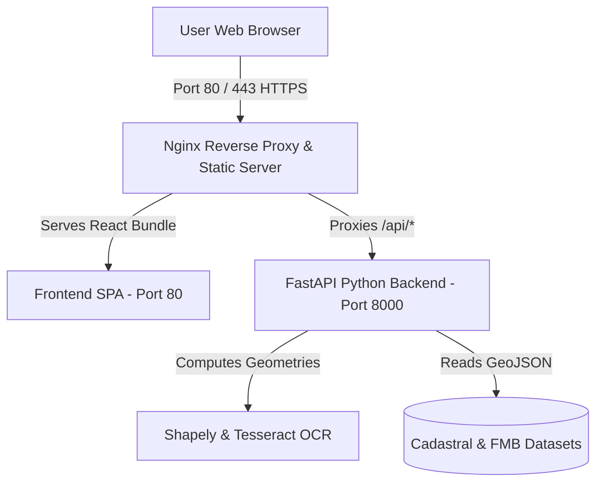

# ☁️ FarmAI – GeoLand Intelligence: AWS Cloud Deployment Guide

This document provides a comprehensive, step-by-step guide to deploying the **FarmAI – GeoLand Intelligence** application to Amazon Web Services (AWS).

---

## 📋 Table of Contents

1. [Architecture Overview](#1-architecture-overview)
2. [Prerequisites](#2-prerequisites)
3. [Step 1: Launch an AWS EC2 Instance](#3-step-1-launch-an-aws-ec2-instance)
4. [Step 2: Connect to Your EC2 Instance](#4-step-2-connect-to-your-ec2-instance)
5. [Step 3: Install Docker & Docker Compose](#5-step-3-install-docker--docker-compose)
6. [Step 4: Deploy Using Docker Compose (Recommended)](#6-step-4-deploy-using-docker-compose-recommended)
7. [Step 5: Alternative Native Deployment (Without Docker)](#7-step-5-alternative-native-deployment-without-docker)
8. [Step 6: Configure Free SSL Certificate (HTTPS)](#8-step-6-configure-free-ssl-certificate-https)
9. [Step 7: Maintenance & CI/CD Redeployment](#9-step-7-maintenance--cicd-redeployment)
10. [Step 8: Troubleshooting Common Issues](#10-step-8-troubleshooting-common-issues)

---

## 1. Architecture Overview



* **Frontend**: React 18 + Vite + Tailwind CSS v4 + Leaflet GIS.
* **Backend**: Python 3.11 + FastAPI + Uvicorn + Shapely + PyPDF + Tesseract OCR.
* **Orchestration**: Docker Compose with automatic container restart and network bridging.

---

## 2. Prerequisites

* An active **AWS Account** ([Sign up for Free Tier](https://aws.amazon.com/free/)).
* GitHub repository access: `https://github.com/krishnakanthm2805/farmai_project.git`.
* SSH Client (Terminal / PowerShell / PuTTY).

---

## 3. Step 1: Launch an AWS EC2 Instance

1. Log in to the [AWS Management Console](https://console.aws.amazon.com/).
2. In the top search bar, type **EC2** and click **EC2**.
3. Click the orange **"Launch Instance"** button.
4. Fill in the following instance parameters:

### A. Name and OS
* **Name**: `FarmAI-Production-Server`
* **Application and OS Images (AMI)**: **Ubuntu Server 24.04 LTS (HVM)** or **Ubuntu 22.04 LTS**.
* **Architecture**: `64-bit (x86)`.

### B. Instance Type
* **Instance type**: `t2.micro` (Free Tier eligible) or `t3.small` (2 vCPU, 2GB RAM — recommended for faster OCR execution).

### C. Key Pair (Login)
* Click **Create new key pair**.
* **Key pair name**: `farmai-key`
* **Key pair type**: `RSA`
* **Private key format**: `.pem` (for OpenSSH / macOS / Linux / Windows 10/11 PowerShell) or `.ppk` (for PuTTY).
* Click **Create key pair** and save the downloaded file safely on your computer.

### D. Network Settings & Security Group Rules
Select **Create security group** and check the following rules:

| Type | Protocol | Port Range | Source | Purpose |
| :--- | :--- | :--- | :--- | :--- |
| **SSH** | TCP | `22` | `0.0.0.0/0` (or My IP) | Remote terminal access |
| **HTTP** | TCP | `80` | `0.0.0.0/0` (Anywhere) | Public web dashboard |
| **HTTPS** | TCP | `443` | `0.0.0.0/0` (Anywhere) | Secure SSL web access |
| **Custom TCP** | TCP | `8000` | `0.0.0.0/0` (Anywhere) | Direct FastAPI REST API access |

### E. Storage
* Configure storage to **15 GB - 20 GB gp3** (Root Volume).

5. Click **"Launch instance"** at the bottom right.
6. Return to the EC2 Instances dashboard and copy your **Public IPv4 address** (e.g., `54.210.120.45`).

---

## 4. Step 2: Connect to Your EC2 Instance

### On Windows (PowerShell) / macOS / Linux:

1. Open your terminal in the directory where your `.pem` key file is saved:
```bash
# Set proper permissions on the private key file (macOS/Linux only)
chmod 400 farmai-key.pem

# Connect to the EC2 instance
ssh -i "farmai-key.pem" ubuntu@<YOUR_EC2_PUBLIC_IP>
```

*(Replace `<YOUR_EC2_PUBLIC_IP>` with your actual EC2 public IP).*

---

## 5. Step 3: Install Docker & Docker Compose

Run the following commands in the EC2 Ubuntu terminal:

```bash
# 1. Update Ubuntu packages
sudo apt update && sudo apt upgrade -y

# 2. Install Docker, Docker Compose plugin, and Git
sudo apt install -y docker.io docker-compose-v2 git

# 3. Start and enable Docker service
sudo systemctl enable --now docker

# 4. Add the ubuntu user to the docker group
sudo usermod -aG docker $USER
```

---

## 6. Step 4: Deploy Using Docker Compose (Recommended)

### 1. Clone the GitHub Repository
```bash
git clone https://github.com/krishnakanthm2805/farmai_project.git
cd farmai_project
```

### 2. Build & Launch Containers
```bash
sudo docker compose up -d --build
```

### 3. Verify Containers are Running
```bash
sudo docker ps
```

You should see two healthy running containers:
* `farmai-frontend` on port `0.0.0.0:80->80/tcp`
* `farmai-backend` on port `0.0.0.0:8000->8000/tcp`

### 4. Open the Application
Open your web browser and navigate to:
* **Web Dashboard**: `http://<YOUR_EC2_PUBLIC_IP>`
* **Interactive API Docs (Swagger)**: `http://<YOUR_EC2_PUBLIC_IP>:8000/docs`

---

## 7. Step 5: Alternative Native Deployment (Without Docker)

If you prefer running Python and Node directly on the host using systemd and Nginx:

### 1. Install System Dependencies
```bash
sudo apt update
sudo apt install -y python3-pip python3-venv tesseract-ocr tesseract-ocr-tam nginx nodejs npm
```

### 2. Configure Backend Service
```bash
cd /home/ubuntu/farmai_project/backend
python3 -m venv venv
source venv/bin/activate
pip install -r requirements.txt
```

Create a systemd unit file for the backend:
```bash
sudo nano /etc/systemd/system/farmai-backend.service
```

Paste the following content:
```ini
[Unit]
Description=FarmAI FastAPI Backend Service
After=network.target

[Service]
User=ubuntu
WorkingDirectory=/home/ubuntu/farmai_project/backend
ExecStart=/home/ubuntu/farmai_project/backend/venv/bin/uvicorn main:app --host 127.0.0.1 --port 8000
Restart=always

[Install]
WantedBy=multi-user.target
```

Enable and start the service:
```bash
sudo systemctl daemon-reload
sudo systemctl enable --now farmai-backend
```

### 3. Build Frontend & Configure Nginx
```bash
cd /home/ubuntu/farmai_project/frontend
npm install
npm run build
```

Configure Nginx reverse proxy:
```bash
sudo nano /etc/nginx/sites-available/default
```

Paste the following Nginx block:
```nginx
server {
    listen 80 default_server;
    server_name _;

    root /home/ubuntu/farmai_project/frontend/dist;
    index index.html;

    location / {
        try_files $uri $uri/ /index.html;
    }

    location /api/ {
        proxy_pass http://127.0.0.1:8000/api/;
        proxy_set_header Host $host;
        proxy_set_header X-Real-IP $remote_addr;
        proxy_set_header X-Forwarded-For $proxy_add_x_forwarded_for;
    }
}
```

Test and restart Nginx:
```bash
sudo nginx -t
sudo systemctl restart nginx
```

---

## 8. Step 6: Configure Free SSL Certificate (HTTPS)

To secure your deployment with HTTPS using Let's Encrypt:

1. Point your domain (e.g. `farmai.example.com`) to your **EC2 Public IP** via an **A-Record** in your DNS provider (Route 53, GoDaddy, Cloudflare, etc.).
2. Install Certbot on EC2:
```bash
sudo apt install certbot python3-certbot-nginx -y
```
3. Generate the SSL certificate:
```bash
sudo certbot --nginx -d farmai.example.com
```
Certbot will automatically configure HTTPS and renew certificates.

---

## 9. Step 7: Maintenance & CI/CD Redeployment

Whenever you push new code to your GitHub repository, update your live AWS instance with:

```bash
cd /home/ubuntu/farmai_project

# Pull latest code
git pull origin main

# Rebuild and restart containers
sudo docker compose up -d --build
```

---

## 10. Step 8: Troubleshooting Common Issues

| Problem | Cause | Solution |
| :--- | :--- | :--- |
| **Site cannot be reached** | Security Group missing port 80/8000 | Go to AWS Console → EC2 → Security Groups → Add Inbound rule for Port `80` & `8000` with source `0.0.0.0/0`. |
| **OCR Error on Scanned PDF** | Tesseract language pack missing | Ensure `tesseract-ocr` and `tesseract-ocr-tam` are installed. |
| **Docker Permission Denied** | Current user not in docker group | Run commands with `sudo` or execute `sudo usermod -aG docker ubuntu`. |
| **Map Tiles Not Loading** | Mixed content blocked on HTTPS | Ensure all tile URLs in `GisMap.jsx` use `https://`. |

---

## 📞 Support & Verification Checklist

- [x] Backend Health Endpoint: `GET /api/health` returns `200 OK`.
- [x] Cadastral Parcels Layer: `GET /api/cadastral/parcels` returns GeoJSON.
- [x] GIS Satellite Map: Centering and overlay buffers functional.
- [x] Document Ingestion: Form 10 Tamil e-Patta PDF extraction functional.
