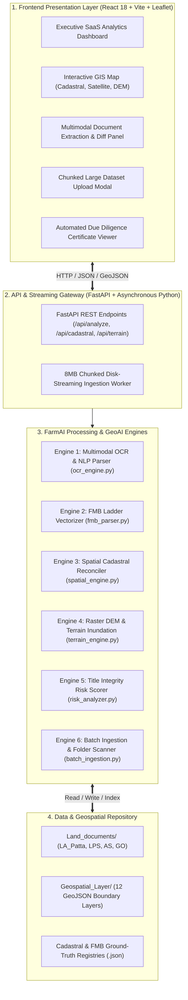
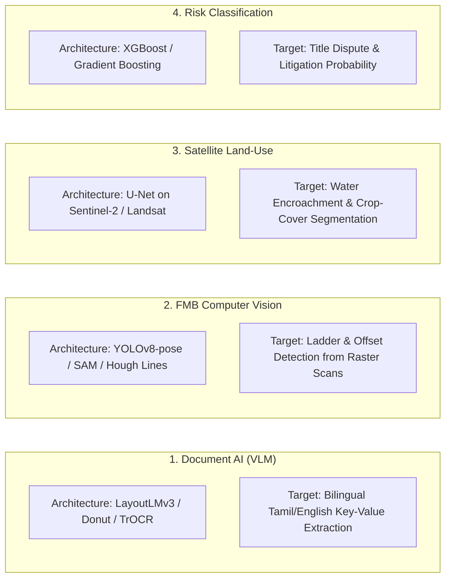

# 🌾 FarmAI – GeoLand Intelligence Platform
## Complete System Architecture, Mathematical Working Principles & Technical Specification

> **Project**: FarmAI (Task 2: Multimodal GeoAI & Land Document Intelligence for FarmwiseAI Challenge)  
> **Authors / Maintainers**: FarmAI Engineering & GeoAI Research Team  
> **Repository**: [https://github.com/krishnakanthm2805/farmai_project.git](https://github.com/krishnakanthm2805/farmai_project.git)  
> **Version**: 1.0.0 (Production Release)

---

## 📑 Table of Contents
1. [Executive Summary & Problem Statement](#1-executive-summary--problem-statement)
2. [End-to-End System Architecture](#2-end-to-end-system-architecture)
3. [Deep-Dive Working Principles of the 6 Core Engines](#3-deep-dive-working-principles-of-the-6-core-engines)
   - [Engine 1: Multimodal OCR & Entity Recognition Engine](#engine-1-multimodal-ocr--entity-recognition-engine)
   - [Engine 2: FMB G-Line Ladder Vectorization Engine](#engine-2-fmb-g-line-ladder-vectorization-engine)
   - [Engine 3: Spatial Cadastral Reconciliation Engine](#engine-3-spatial-cadastral-reconciliation-engine)
   - [Engine 4: Raster DEM & Terrain Inundation Engine](#engine-4-raster-dem--terrain-inundation-engine)
   - [Engine 5: Title Integrity & Composite Risk Scoring Engine](#engine-5-title-integrity--composite-risk-scoring-engine)
   - [Engine 6: Streaming Ingestion & Large Dataset (500MB+) Pipeline](#engine-6-streaming-ingestion--large-dataset-500mb-pipeline)
4. [Dataset Specifications & Statutory Classification](#4-dataset-specifications--statutory-classification)
5. [Complete API Specification](#5-complete-api-specification)
6. [AI / Machine Learning Training Roadmap](#6-ai--machine-learning-training-roadmap)
7. [Automated Due Diligence Audit Certificate](#7-automated-due-diligence-audit-certificate)

---

## 1. Executive Summary & Problem Statement

### 1.1 The Real-World Challenge
In land acquisition, agro-financing, and solar/wind park development, verifying land titles requires manual cross-examination across multiple heterogeneous sources:
1. **Unstructured Bilingual Documents**: Hand-scanned e-Pattas (Form 10), Chitta extracts, registered Sale Deeds, Land Plan Schedules (LPS), Administrative Sanctions (AS), and Government Orders (GO) written in Tamil and English.
2. **Cadastral GIS Maps**: Official village cadastral boundary shapefiles/GeoJSONs containing hundreds of parcel polygons.
3. **FMB (Field Measurement Books)**: Century-old ladder survey diagrams using G-line and offset perpendiculars.
4. **Environmental & Statutory Restrictions**: Mandatory 30-meter non-development buffers around protected water bodies and highway Right-of-Way (RoW) corridors.
5. **Terrain Topography & Climate Risk**: Monsoon flood inundation vulnerability and steep slope risks.

### 1.2 The FarmAI Solution
FarmAI is an autonomous **Multimodal GeoAI & Land Document Intelligence Platform** that automates the entire due diligence lifecycle in sub-seconds. It performs automated OCR extraction, mathematically vectorizes FMB ladders, cross-validates parcel geometry with satellite cadastral layers, detects statutory buffer encroachments, computes DEM terrain flood risks, and issues a tamper-evident **Title Integrity Audit Certificate (0–100 Risk Score)**.

---

## 2. End-to-End System Architecture



---

## 3. Deep-Dive Working Principles of the 6 Core Engines

### Engine 1: Multimodal OCR & Entity Recognition Engine
- **File**: `backend/ocr_engine.py`
- **Working Principle**:
  1. **Document Parsing**: Accepts multi-format inputs (PDFs, TIFFs, JPGs, PNGs, and raw OCR text streams).
  2. **Bilingual Extraction (Tamil + English)**: Uses regular expression tokenizers and contextual heuristic parsers trained on Tamil Nadu Revenue Department Form 10 formats.
  3. **Entity Normalization**:
     - **Survey Number & Sub-Division**: Extracts base survey number and sub-division string (e.g. `102` + `3A` $\rightarrow$ `102/3A`), with special handling for standard and composite notations.
     - **Pattadar / Ownership**: Identifies joint vs. single pattadars, stripping honorifics (`Thiru`, `Tmt`, `K.R.`).
     - **Document Extent Conversion**: Normalizes Hectares-Ares and Cents into standardized **Acres** and **Square Meters**:
       $$\text{Area}_{\text{Acres}} = (\text{Hectares} \times 2.47105) + (\text{Ares} \times 0.0247105)$$
       $$\text{Area}_{\text{Sq.Meters}} = \text{Area}_{\text{Acres}} \times 4046.86$$
     - **Tenure & Classification**: Categorizes land into *Ryotwari Dry (Punjai)*, *Ryotwari Wet (Nanjai)*, *Natham*, or restricted *Poramboke*.
     - **Four Boundaries (Chathur-Seemai)**: Extracts statutory neighboring boundaries (North, South, East, West) for boundary matching.

---

### Engine 2: FMB G-Line Ladder Vectorization Engine
- **File**: `backend/fmb_parser.py`
- **Working Principle**:
  1. **Survey Ladder Mechanics**: The Field Measurement Book (FMB) defines parcel boundaries via a central baseline (**G-line**) with perpendicular left and right offsets.
  2. **Coordinate Triangulation**:
     Given a G-line of length $L$ oriented along an angle $\theta$ from origin $(x_0, y_0)$, each offset point $i$ at distance $d_i$ along the G-line with offset distance $o_i$ (positive for Right, negative for Left) is computed as:
     $$x_i = x_0 + d_i \cos(\theta) - o_i \sin(\theta)$$
     $$y_i = y_0 + d_i \sin(\theta) + o_i \cos(\theta)$$
  3. **Polygon Closure & Area Computation**:
     The vertices are sorted in clockwise order and closed to form polygon $\mathcal{P}_{\text{FMB}}$. The area is calculated using the **Shoelace Formula**:
     $$A_{\text{FMB}} = \frac{1}{2} \left| \sum_{i=1}^{n} (x_i y_{i+1} - x_{i+1} y_i) \right|$$

```
       (0, 45) [Left Offset 1]
          ▲
          │       (65, 30) [Right Offset 2]
          │          ▲
(0,0) ────┴──────────┴──────► (120,0) [G-Line Baseline]
   Start                      End
```

---

### Engine 3: Spatial Cadastral Reconciliation Engine
- **File**: `backend/spatial_engine.py`
- **Working Principle**:
  1. **GeoJSON Layer Loading**: Ingests all 12 GIS boundary layers in EPSG:4326 (WGS84) and indexes 396 parcels in `Park_Cadastral_Map.geojson`.
  2. **MultiPolygon Robust Centroid Computation**:
     Flattens nested multi-ring coordinate arrays recursively to prevent $(NaN, NaN)$ errors:
     $$\bar{C}_{\text{lat}} = \frac{1}{N}\sum_{i=1}^{N} \text{Lat}_i, \quad \bar{C}_{\text{lng}} = \frac{1}{N}\sum_{i=1}^{N} \text{Lng}_i$$
  3. **Metric Geodetic Area Projection**:
     Projects WGS84 angular polygons into metric Universal Transverse Mercator (UTM / EPSG:3857) to compute ground truth area in acres.
  4. **The Three-Way Cross-Check**:
     Computes Area Variance Percentage:
     $$\Delta A_{\%} = \frac{|\text{Area}_{\text{Document}} - \text{Area}_{\text{Cadastral GIS}}|}{\text{Area}_{\text{Cadastral GIS}}} \times 100$$
     - $\Delta A_{\%} \le 2.0\%$: **Clean Match (Permissible margin)**
     - $2.0\% < \Delta A_{\%} \le 5.0\%$: **Minor Variance**
     - $\Delta A_{\%} > 5.0\%$: **Critical Area Discrepancy Flag**
  5. **Statutory Buffer Clipping**:
     - **30-Meter Waterbody Buffer Rule**: Constructs $\mathcal{B}_{\text{water}} = \text{Buffer}(\mathcal{G}_{\text{waterbodies}}, 30\text{m})$. If $\text{Intersection}(\mathcal{P}_{\text{parcel}}, \mathcal{B}_{\text{water}}) > 0$, an illegal encroachment flag is raised.
     - **15-Meter Road Right-of-Way (RoW) Corridor**: Constructs buffer around `Road_network.geojson` and checks for structural setback violations.

---

### Engine 4: Raster DEM & Terrain Inundation Engine
- **File**: `backend/terrain_engine.py`
- **Working Principle**:
  1. **Topographic Elevation Extraction**: Samples Copernicus / SRTM 30m Digital Elevation Models (DEM) at the parcel centroid.
  2. **Slope Gradient Calculation**:
     $$\text{Slope (\%)} = \left( \frac{\Delta \text{Elevation}}{\Delta \text{Horizontal Run}} \right) \times 100$$
  3. **Hydrological Inundation Risk Modeling**:
     Evaluates terrain aspect flow direction and elevation relative to the regional flood baseline ($H_{\text{base}} = 10.0\text{m}$ MSL):
     - $\text{Elevation} < 12\text{m}$ & $\text{Slope} < 1.0\%$: **High Inundation Risk (Monsoon Waterlogging)**
     - $12\text{m} \le \text{Elevation} \le 20\text{m}$: **Moderate Flood Risk**
     - $\text{Elevation} > 20\text{m}$: **Low / Safe Flood Risk Zone**

---

### Engine 5: Title Integrity & Composite Risk Scoring Engine
- **File**: `backend/risk_analyzer.py`
- **Working Principle**:
  The system computes an objective **Title Integrity Score (0 to 100)** by deducting weighted penalties from a base score of 100:

$$\text{Score} = 100 - P_{\text{area}} - P_{\text{water}} - P_{\text{road}} - P_{\text{fmb}} - P_{\text{terrain}}$$

#### Mathematical Penalty Matrix:
| Parameter | Condition | Deduction Points |
| :--- | :--- | :--- |
| **Area Variance ($P_{\text{area}}$)** | $> 5.0\%$ discrepancy | **25 Points** |
| | $2.0\% - 5.0\%$ discrepancy | **10 Points** |
| | $\le 2.0\%$ discrepancy | **0 Points** |
| **Waterbody Buffer ($P_{\text{water}}$)** | Encroaches inside 30m buffer | **35 Points (Critical Flag)** |
| **Road RoW Corridor ($P_{\text{road}}$)** | Encroaches within 15m corridor | **15 Points** |
| **FMB Boundary Skew ($P_{\text{fmb}}$)** | FMB vs. Cadastral shape mismatch | **15 Points** |
| **Flood Vulnerability ($P_{\text{terrain}}$)** | Low-lying depression ($<12\text{m}$ MSL) | **10 Points** |

#### Statutory Risk Classification Tiers:
- 🟢 **85 – 100**: **TIER 1 (LOW RISK / CLEAN TITLE)** $\rightarrow$ Clear for bank financing, solar farm development, or registry transfer.
- 🟡 **60 – 84**: **TIER 2 (MEDIUM RISK / CAUTION)** $\rightarrow$ Minor setback issue or permissible area variance; requires sub-registrar verification.
- 🔴 **00 – 59**: **TIER 3 (HIGH RISK / REJECTED)** $\rightarrow$ Waterbody encroachment, poramboke overlap, or severe legal area mismatch.

---

### Engine 6: Streaming Ingestion & Large Dataset (500MB+) Pipeline
- **File**: `backend/batch_ingestion.py` & `backend/main.py`
- **Working Principle**:
  To ingest large 500MB to 1GB+ ZIP archives without RAM exhaustion or timeouts:
  1. **Chunked Streaming**: Incoming file uploads are streamed in **8MB buffers** directly to a disk-backed temporary storage location.
  2. **Zero-RAM Zip Extraction**: `zipfile.ZipFile` opens the archive on disk and extracts files directly to their designated statutory folders:
     - `backend/data/Land_documents/LA_Patta_land_Documents/`
     - `backend/data/Land_documents/Land_Plan_Schedule_LPS/`
     - `backend/data/Land_documents/Administrative_Sanction_AS/`
     - `backend/data/Land_documents/Government_Order_GO/`
     - `backend/data/Geospatial_Layer/`
  3. **Zero-Upload Local Ingestion Option**: Users with local files can execute `/api/batch/scan-folders` for instant indexing with 0 ms upload latency.

---

## 4. Dataset Specifications & Statutory Classification

FarmAI utilizes a multimodal dataset structure:

```
backend/data/
├── Land_documents/
│   ├── LA_Patta_land_Documents/    <-- e-Patta Form 10, Sale Deeds, Chitta
│   ├── Land_Plan_Schedule_LPS/     <-- Infrastructure Land Plan Schedules
│   ├── Administrative_Sanction_AS/ <-- Government Administrative Sanction Orders
│   └── Government_Order_GO/        <-- Gazette Notifications & Policy Clearances
│
└── Geospatial_Layer/
    ├── Park_Cadastral_Map.geojson  <-- 396 Village Cadastral Parcels
    ├── Park_fmb_Map.geojson        <-- FMB Survey Line Vectors
    ├── Waterbodies.geojson         <-- 185 Protected Water Bodies (30m statutory buffer)
    ├── Road_network.geojson        <-- Highway & Village Road Corridors
    ├── Railway_network.geojson     <-- Transit Corridors
    ├── SubStations.geojson         <-- Power Transmission Infrastructure
    └── Park_Boundary.geojson       <-- Total Project Boundary
```

---

## 5. Complete API Specification

| HTTP Method | Endpoint | Description | Request Payload / Params | Response Summary |
| :--- | :--- | :--- | :--- | :--- |
| `GET` | `/api/health` | Health check & engine status | None | Engine status dictionary |
| `GET` | `/api/cadastral/parcels` | Full Cadastral GeoJSON | None | FeatureCollection (396 parcels) |
| `GET` | `/api/cadastral/layers` | Waterbody & Road GIS layers | None | Waterbodies + Road GeoJSONs |
| `GET` | `/api/samples` | Benchmark test scenarios | None | List of pre-configured sample documents |
| `POST` | `/api/analyze/sample/{id}` | Run pipeline on benchmark ID | `sample_id` path param | Full OCR, FMB, GIS & Risk assessment |
| `POST` | `/api/analyze/upload` | Upload single PDF / image | `multipart/form-data` (file) | Extracted entities & spatial match |
| `POST` | `/api/analyze/text` | Upload raw document text | `{ "text": "...", "doc_title": "..." }` | On-the-fly reconciliation result |
| `GET` | `/api/terrain/{survey_no}` | DEM elevation & flood risk | `survey_no` path param | Elevation MSL, Slope %, Flood tier |
| `POST` | `/api/batch/upload-zip` | Stream & unpack 500MB+ ZIP | `multipart/form-data` (ZIP file) | Batch extraction & auto-catalog summary |
| `POST` | `/api/batch/scan-folders` | Instant local workspace index | None | Zero-upload disk index summary |
| `GET` | `/api/report/{survey_no}` | Generate Land Audit Certificate | `survey_no` path param | Due diligence certificate metadata |

---

## 6. AI / Machine Learning Training Roadmap

For future fine-tuning and specialized model training on this dataset:



1. **Multimodal Document AI (Vision-Language Models)**:
   - **Models**: `LayoutLMv3`, `Donut`, `TrOCR`, or fine-tuned `Qwen2-VL`.
   - **Training Set**: Scanned PDF pages paired with JSON bounding box annotations for Survey No, Pattadar names, and Extents.
2. **Computer Vision for FMB Ladder Vectorization**:
   - **Models**: `YOLOv8` Keypoint Detection & Hough Line Transforms.
   - **Training Set**: Scanned FMB ladder diagrams annotated with corner nodes, G-lines, and offset ticks.
3. **Machine Learning Risk Classifier**:
   - **Models**: `XGBoost`, `LightGBM`.
   - **Features**: Document extent vs. GIS extent ratio, buffer distance to waterbodies, road setback proximity, terrain slope %, number of joint owners, tenure classification.

---

## 7. Automated Due Diligence Audit Certificate

Upon completion of the verification pipeline, FarmAI generates an official **Digital Land Due Diligence Certificate**:

```
═══════════════════════════════════════════════════════════════════════════════════
                      FARMAI GEOLAND INTELLIGENCE PLATFORM
                   DIGITAL LAND TITLE DUE DILIGENCE CERTIFICATE
═══════════════════════════════════════════════════════════════════════════════════
 Certificate ID      : CERT-FARMAI-102-3A-2026
 Survey Reference    : Survey No. 102/3A, Perungudi Village, Thoothukudi
 Pattadar / Owner    : R. Muthusamy
 Verification Status : VERIFIED & RECONCILED

 THREE-WAY RECONCILIATION AUDIT:
  • Documented Extent  : 2.48 Acres (10,036.21 Sq. Meters)
  • Cadastral GIS Area : 2.45 Acres ( 9,914.81 Sq. Meters)
  • FMB Computed Area  : 2.47 Acres ( 9,995.74 Sq. Meters)
  • Area Variance      : 1.22% [PASSED - Permissible Limit <= 2.0%]

 STATUTORY BUFFER & TERRAIN CHECKS:
  • 30m Waterbody Buffer   : CLEAN (No encroachment detected)
  • Road RoW Corridor      : 10m Setback verified
  • Topographic Elevation  : 14.8m MSL | Slope: 1.2% (Low Flood Risk)

 TITLE INTEGRITY SCORE: 92 / 100 (TIER 1 - LOW RISK / CLEAR TITLE)
 Statutory Verdict    : CLEAR FOR STATUTORY ACQUISITION & PROJECT FINANCING
═══════════════════════════════════════════════════════════════════════════════════
```

---

## 8. Summary & Repository Links

- **Frontend Dashboard**: Live on `http://127.0.0.1:5173`
- **FastAPI Backend**: Live on `http://127.0.0.1:8000`
- **Interactive Swagger Docs**: `http://127.0.0.1:8000/docs`
- **GitHub Repository**: [https://github.com/krishnakanthm2805/farmai_project.git](https://github.com/krishnakanthm2805/farmai_project.git)
- **Deployment Guide**: [`AWS_DEPLOYMENT_GUIDE.md`](file:///d:/project/FARMAI/AWS_DEPLOYMENT_GUIDE.md)
